# rrweb Record and Replay - Common Problems

## 1. Event Order Issue

### **✅ Current Working Order:**
```javascript
1. Event type 4 (Meta) → Session metadata
2. Event type 2 (FullSnapshot) → Complete DOM structure  
3. Event type 3+ (Incremental) → User interactions & changes
```

### **❌ Previous Problem:**
When **Meta events arrived first**, the old implementation would:
- Try to process metadata **without a DOM foundation**
- Cause **DOM structure crashes** 
- Lead to the `insertStyleRules` errors we were seeing

### **🔧 Why the Iframe Implementation Fixed This:**

#### **Before (Div Container):**
```javascript
// Old problematic approach
const container = document.createElement('div'); // Just a div in main document
const replayer = new rrweb.Replayer([], { root: container }); // Shared document context
// Meta event arrives → tries to apply to main document → CRASH!
```

#### **After (Iframe Document):**
```javascript
// New working approach  
const iframe = document.createElement('iframe'); // Isolated document
const iframeDoc = iframe.contentDocument; // Clean document context
const replayer = new iframeWindow.rrweb.Replayer([], { 
    root: replayerContainer, // Isolated container
    liveMode: true // Proper streaming mode
});
// Meta event arrives → applies to isolated iframe document → SUCCESS!
```

### **🎉 Key Fixes:**

#### **1. Document Isolation**
- **Iframe provides clean document context**
- **No interference with main page DOM**
- **Proper document.adoptedStyleSheets support**

#### **2. Proper Event Sequence Handling**
- **Meta events** can safely initialize in isolated environment
- **FullSnapshot** builds DOM foundation in iframe
- **Incremental events** apply changes to established DOM

#### **3. Live Mode Setup**
- **`liveMode: true`** handles event streaming correctly
- **`startLive()`** properly manages event timing
- **Event buffering** works in isolated context

### **🔍 Your Understanding is 100% Correct:**

> **"Previously, when we get the meta event first, DOM structure was crashed. Now it's handled properly."**

**Exactly!** The iframe implementation solved the core issue:

- ✅ **Meta events** are processed safely in isolation
- ✅ **FullSnapshot** establishes clean DOM foundation  
- ✅ **Event sequence** flows correctly without crashes
- ✅ **No more `insertStyleRules` errors**

### **📈 Performance Evidence:**

Your test shows **perfect event handling**:
```
{"2":1,"3":8,"4":1} = 1 FullSnapshot + 8 Incremental + 1 Meta
```

## 2. Wrong Script Injection into iframe

- problem

```mermaid js
graph TD
    A[Our Failed Approach] --> B[External Script Loading]
    B --> C[script.src = 'url']
    C --> D[❌ Blocked by iframe restrictions]
    
    E[RRWeb Official Pattern] --> F[Inline Script Injection]  
    F --> G[script.innerHTML = code]
    G --> H[✅ Works in iframe context]
    
    I[Why This Works] --> J[No network requests needed]
    J --> K[No CORS issues]
    K --> L[No CSP restrictions]
    L --> M[Direct code execution]
```


- solution

- Steps
🔧 Implementation Strategy:
- 1. Main Context Fetch
    ```
    // Step 1: Fetch rrweb script content as text
    const response = await fetch('https://unpkg.com/rrweb@latest/dist/rrweb.js');
    const rrwebCode = await response.text();

    // Step 2: Inject as inline code (not external src)
    const script = iframeDoc.createElement('script');
    script.type = 'text/javascript';
    script.innerHTML = rrwebCode; // ← This works in iframe!
    iframeDoc.head.appendChild(script);
    ```

- 2. Iframe Inline Injection
    ```
    // Fetch in main React context (unrestricted)
    const rrwebCode = await fetch('/node_modules/rrweb/dist/rrweb.js')
    .then(r => r.text())
    .catch(() => fetch('https://unpkg.com/rrweb@latest/dist/rrweb.js'))
    .then(r => r.text());
    ```

- 3. No Polling Needed

- 4. local rrweb library accessible in production?
    ```
    
    ```


---
### References

