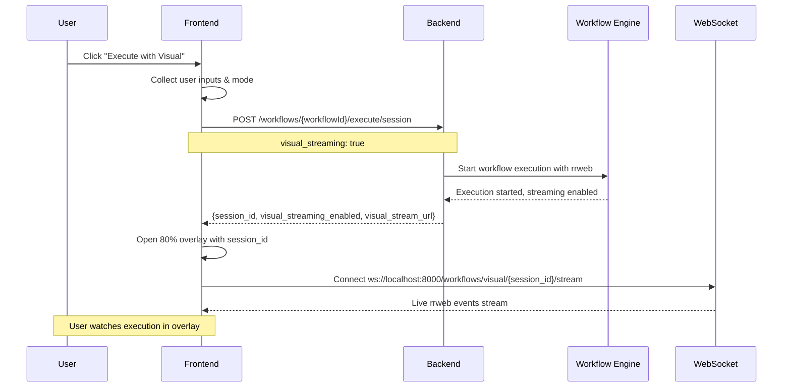
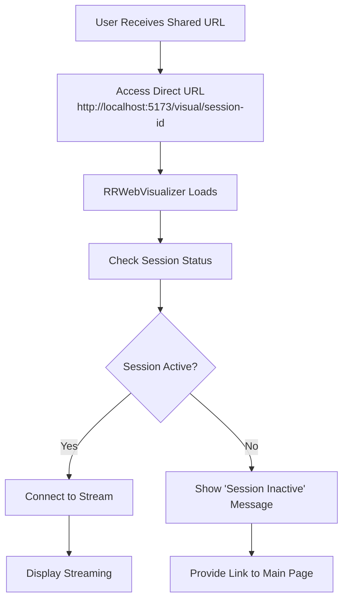

# 🏗️ **Comprehensive Architecture Guide: Manual Execution + Overlay Streaming**

## 🎯 **User Flow Overview**

This architecture prioritizes **manual user control** with **embedded overlay streaming** for optimal user experience across desktop and mobile devices.

## 🛤️ **Primary User Journey**
Ran tool
## 📡 **API Endpoints & Data Flow**

### **Primary Path: Manual Execution**



## 🔧 **Detailed Technical Implementation**

### **1. Manual Execution API Call**

**Endpoint**: `POST /workflows/{workflowId}/execute/session`

**Request Payload**:
```json
{
  "inputs": {
    "search_term": "user_input_value",
    "location": "user_selected_location"
  },
  "session_token": "user_session_jwt",
  "mode": "cloud-run",
  "visual": true,
  "visual_streaming": true,
  "visual_quality": "standard",
  "visual_events_buffer": 1000
}
```

**Response**:
```json
{
  "success": true,
  "task_id": "7336a7f4-53ba-435a-abe5-55560c74b143",
  "workflow": "GoAirbnb",
  "session_id": "visual-7336a7f4-53ba-435a-abe5-55560c74b143",
  "visual_streaming_enabled": true,
  "visual_stream_url": "/workflows/visual/visual-7336a7f4-53ba-435a-abe5-55560c74b143/stream",
  "viewer_url": "/workflows/visual/visual-7336a7f4-53ba-435a-abe5-55560c74b143/viewer",
  "visual_quality": "standard",
  "log_position": 0,
  "message": "Workflow started successfully"
}
```

### **2. WebSocket Streaming Connection**

**Endpoint**: `ws://localhost:8000/workflows/visual/{session_id}/stream`

**Event Stream Format**:
```json
{
  "type": "rrweb_event",
  "event_data": {
    "type": 2,
    "timestamp": 1673123456789,
    "data": {
      "node": {...},
      "target": 123,
      "action": "click"
    }
  },
  "session_id": "visual-7336a7f4-53ba-435a-abe5-55560c74b143"
}
```

### **3. Status Monitoring (Optional)**

**Endpoint**: `GET /workflows/visual/{session_id}/status`

**Response**:
```json
{
  "success": true,
  "streaming_active": true,
  "events_processed": 247,
  "connected_clients": 1,
  "session_id": "visual-7336a7f4-53ba-435a-abe5-55560c74b143",
  "workflow_name": "GoAirbnb",
  "status": "running"
}
```

## 🖥️ **Frontend Component Architecture**

### **Component Hierarchy**:
```
MainPage
├── WorkflowGallery
│   ├── WorkflowCard
│   │   ├── WorkflowDetails
│   │   ├── InputForm
│   │   └── ExecuteButton ("Execute with Visual")
│   └── VisualStreamingOverlay (80% screen)
│       └── RRWebVisualizer
│           ├── WebSocket Connection
│           ├── RRWeb Player
│           └── Event Logs
```

### **State Management Flow**:

```typescript
// AppContext State
interface AppState {
  // Existing states...
  visualOverlayActive: boolean;
  currentStreamingSession: string | null;
  overlayWorkflowInfo: {
    name: string;
    taskId: string;
    mode: string;
  } | null;
}

// Execution Flow
const executeWorkflow = async (workflowId, inputs, mode) => {
  // 1. Call manual execution API
  const response = await workflowService.executeWorkflow(
    workflowId, inputs, sessionToken, mode, true // visual=true
  );
  
  if (response.success && response.session_id) {
    // 2. Open overlay instead of new tab
    setVisualOverlayActive(true);
    setCurrentStreamingSession(response.session_id);
    setOverlayWorkflowInfo({
      name: response.workflow,
      taskId: response.task_id,
      mode: mode
    });
  }
};
```

## 📱 **Mobile & Desktop Experience**

### **Desktop (80% Overlay)**:
```
┌─────────────────────────────────────┐
│ Main Page (20% visible)             │
│ ┌─────────────────────────────────┐ │
│ │                                 │ │
│ │     RRWeb Streaming Overlay     │ │
│ │         (80% screen)            │ │
│ │                                 │ │
│ │  ┌─────────┐  ┌─────────────┐   │ │
│ │  │ Player  │  │ Event Logs  │   │ │
│ │  │         │  │             │   │ │
│ │  └─────────┘  └─────────────┘   │ │
│ │                                 │ │
│ │           [Close X]             │ │
│ └─────────────────────────────────┘ │
└─────────────────────────────────────┘
```

### **Mobile (80% Overlay)**:
```
┌───────────────┐
│ Main (20%)    │
│ ┌───────────┐ │
│ │           │ │
│ │  RRWeb    │ │
│ │ Streaming │ │
│ │  (80%)    │ │
│ │           │ │
│ │  Player   │ │
│ │           │ │
│ │   Logs    │ │
│ │           │ │
│ │ [Close X] │ │
│ └───────────┘ │
└───────────────┘
```

## 🔄 **Alternative Flows**

### **Secondary: Direct URL Access** (Simplified)



### **Sharing Feature**:

**Share Workflow (Main Page Deep-link)**:
```
http://localhost:5173/?workflow=workflow-uuid
→ Opens main page with workflow pre-selected
→ User can fill inputs and execute manually
```

**Share Execution (Direct Visual Link)**:
```
http://localhost:5173/visual/visual-session-id
→ Direct access to visual streaming (if session active)
→ Fallback to main page if session inactive
```

## 🏗️ **Implementation Phases**

### **Phase 1: Core Overlay Implementation**
1. ✅ Update `AppContext.tsx` to use overlay instead of new tab
2. ✅ Create `VisualStreamingOverlay` component (80% screen)
3. ✅ Pass `session_id` from manual execution response
4. ✅ Remove auto-start logic from `RRWebVisualizer`

### **Phase 2: Enhanced UX**
1. ✅ Add overlay animations and mobile optimization
2. ✅ Implement sharing features (deep-links)
3. ✅ Add execution progress indicators
4. ✅ Error handling and retry mechanisms

### **Phase 3: Advanced Features**
1. ✅ Multiple overlay support (if needed)
2. ✅ Overlay resizing and positioning options
3. ✅ Integration with workflow analytics
4. ✅ Advanced sharing and collaboration features

## 🎯 **Key Benefits of This Architecture**

1. **✅ User Control**: Manual trigger with full input support
2. **✅ Seamless Experience**: 80% overlay keeps users on main page
3. **✅ Mobile Friendly**: Responsive overlay design
4. **✅ Simplified Backend**: Uses existing manual execution API
5. **✅ Clean Frontend**: Removes auto-start complexity
6. **✅ Shareable**: Deep-links to workflows and executions
7. **✅ Scalable**: Clear separation of concerns

## 🔧 **Technical Requirements**

### **Frontend Dependencies**:
- Existing `workflowService.executeWorkflow()` method
- WebSocket support for rrweb streaming
- Overlay modal system
- State management for overlay lifecycle

### **Backend Requirements** (Already Available):
- ✅ `POST /workflows/{id}/execute/session` with visual streaming
- ✅ WebSocket endpoint for rrweb events
- ✅ Session status monitoring endpoint

This architecture provides the **optimal user experience** with **manual control**, **embedded overlay**, and **simplified implementation**! 🚀